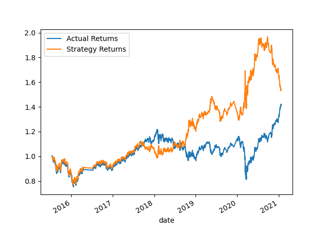

# algorithmic_trading_challenge

### Overview
Various strategies for algorithmic training were performed in order to see the effect of it.  
Some strategies used are:
- Change in parameters
- Change in machine learning models

### Data used
Data used in this exercise is a MSCI based emerging markets ETF price data issed by iShares.  
The price data is from 2015 January until 2021 January.

### Steps
1. Data preparation
2. Feature engineering (Simple moving average (SMA) of 2 different rolling windows were using in this exercise)
3. Split to train and test data
4. Preprocess train data using StandardScaler
5. Use SVC model for predictions
6. Display result 

### Results

#### Case 1. (baseline performance)
Conditions:
- SVC model
- train_begin date: 2015-04-15
- train_end date: 2015-07-15
- short_SMA rolling window = 4
- long_SMA rolling window = 100

Results:  

Overall accuracy is only 55% so not a great result. There difference between the actual returns and strategic returns graph is deviating over time as well.  
The strategic returns slightly outperformed the actual returns at the end of the test period

 

#### Case 2.
Conditions:
- SVC model
- train_begin date: 2015-04-15
- train_end date: 2015-09-15
- short_SMA rolling window = 4
- long_SMA rolling window = 100

Results:  

Overall accuracy slightly rose to 56%, but this may not be a statistically significant improvement.  
The graph between actual returns and strategic returns had pretty good resemblence until mid 2018, then they deviated significantly, then they re-merged together at the end.  
The stratigic return slightly underperformed compared to the actual returns at the end of the test period

 

#### Case 3.
Conditions:
- SVC model
- train_begin date: 2015-04-15
- train_end date: 2015-07-15
- short_SMA rolling window = 20
- long_SMA rolling window = 150

Results:  

Same thing here, the overall accuracy slightly rose to 56%, but unsure if this is a statistically significant improvement.  
The graph between actual returns and strategic returns had pretty good resemblence throughout the entire tested period. There was a slight deviation between the two returns in the last 1-2 years.  
However, the strategic returns underperformed at the end of the test period compared to the actual returns.

#### Result summary for case 1 - 3:
#### Based on the above 3 cases with different parameters, the best returns were observed in the baseline case (case 1).

 

#### Case 4 (using a different machine learning model)
Conditions:
- Adaboost model
- train_begin date: 2015-04-15
- train_end date: 2015-07-15
- short_SMA rolling window = 4
- long_SMA rolling window = 100

Results:  

The Adaboost model had a lower performance in the prediction (52%) compared to the SVC model.  
However, a couple things to note here is that with the Adaboost model, the recall result of '-1' improved significantly (42%) compared to any previous cases using SVC models (~ 1 - 5%)  
In terms of the graph, we can observe that the actual returns and strategic returns starts to deviate from mid 2017 and since then the two graphs do not look the same anymore.  
However, we can see that the strategic returns significantly outperformed the actual returns at the end of the test period.

#### Result summary for all cases:
### Based on all above 4 cases, the case 4 (with Adaboost) had the best algirithmic returns.

 

### Summary
Throughout the tests, we were able to observe that changing parameters can have impact on the results. However, the effects were not very significant. This is probably due to just minor changes in the parameters.  
However, when we changed the machine learning model to a different model, the results were significaly different.   

### References:
How to use image in markdown page: https://stackoverflow.com/questions/14494747/how-to-add-images-to-readme-md-on-github
How to save png file: https://pieriantraining.com/python-tutorial-how-to-export-and-save-a-seaborn-plot/#:~:text=To%20save%20a%20Seaborn%20plot%20as%20a%20PNG%20file%2C%20you,pyplot%20library.

