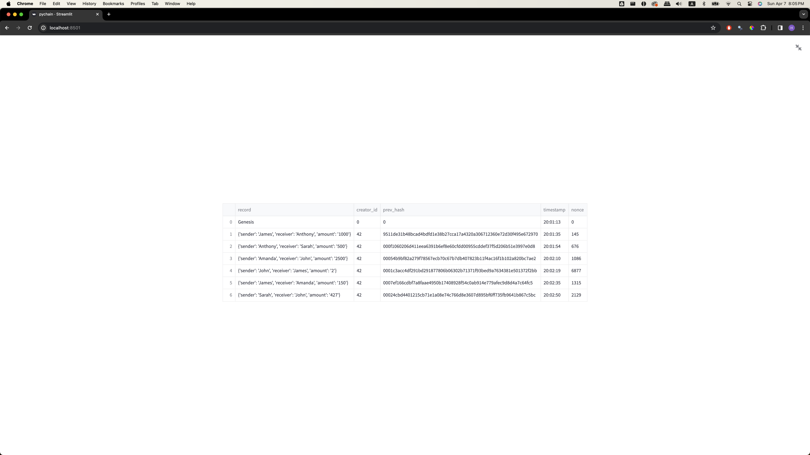
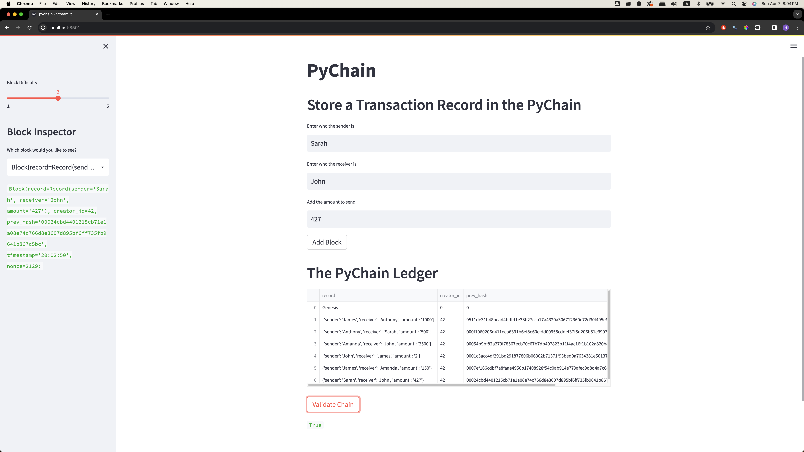

# bc_based_ledger_challenge

### Overview
This challenge consists of building a simple blockchain-based ledger system using streamlit service.  
The python file 'pychain.py' allows the user to insert information about the sender, receiver, and the amount to be transferred, and each transaction is recorded in the blockchain-based ledger system.  
An extra function is added in order to validate whether the blockchain is valid or not.

### Testing the pychain ledger

- This image is a screenshot of the Streamlit application page, and it has details of the blockchain with multiple blocks added to it.

- This image is a screenshot of the Streamlit application page with the validation process. When it prints 'True', that means the blockchain has been validated.

