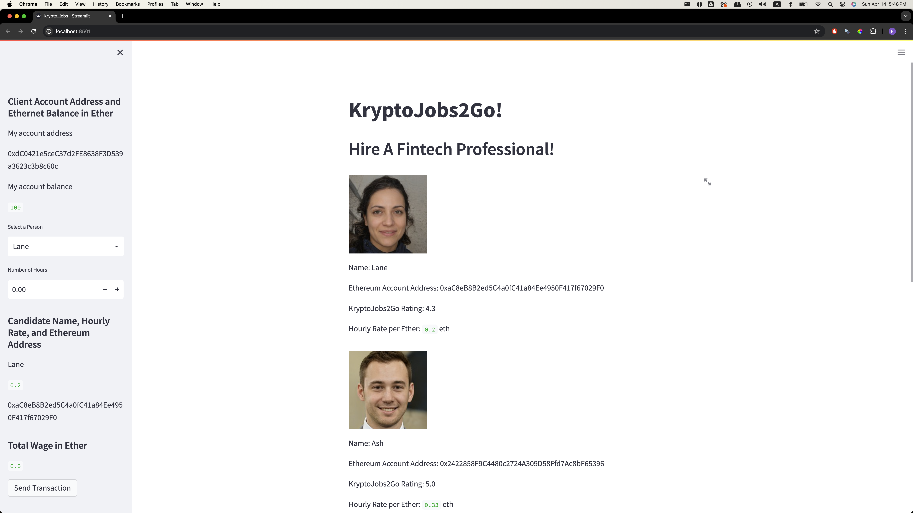
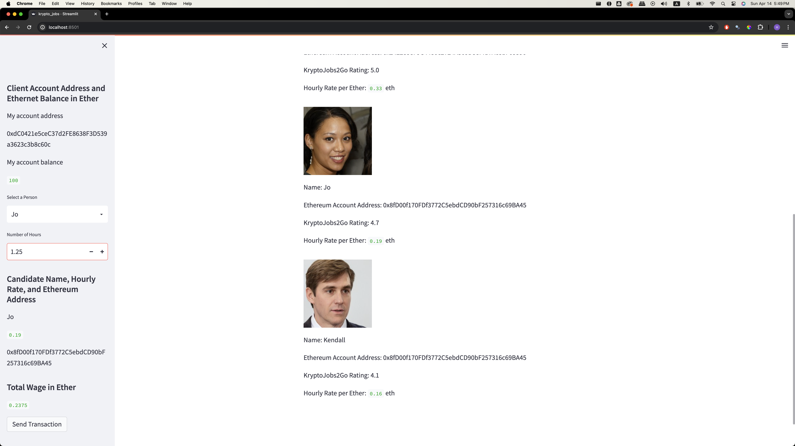
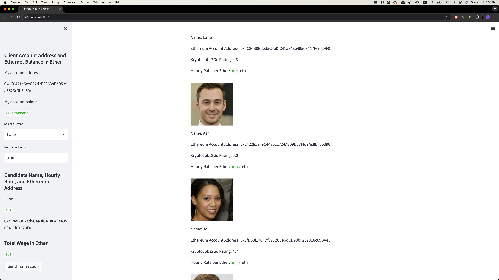
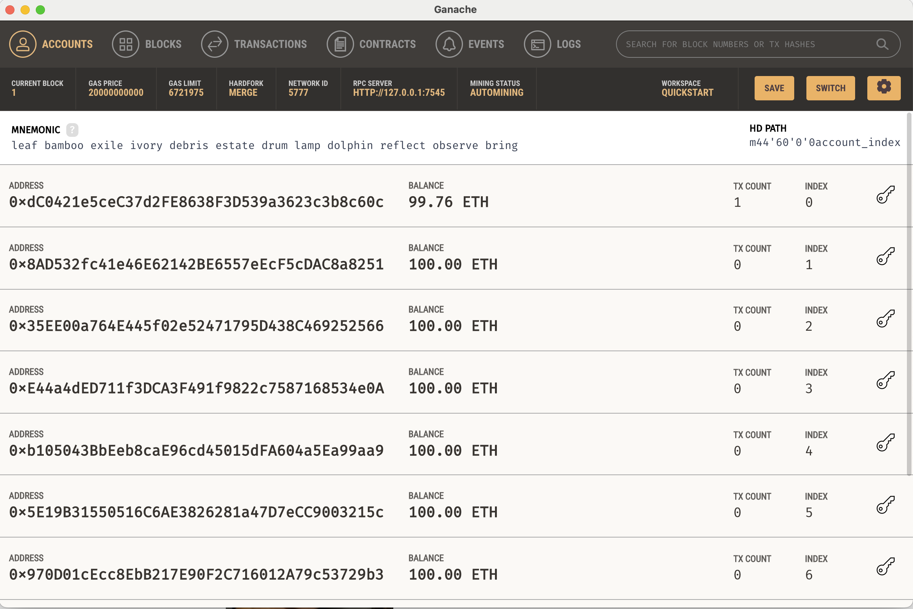
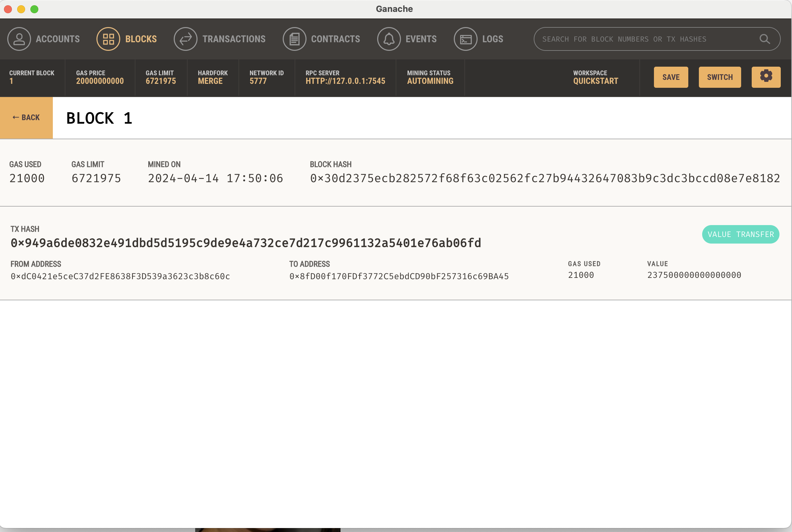
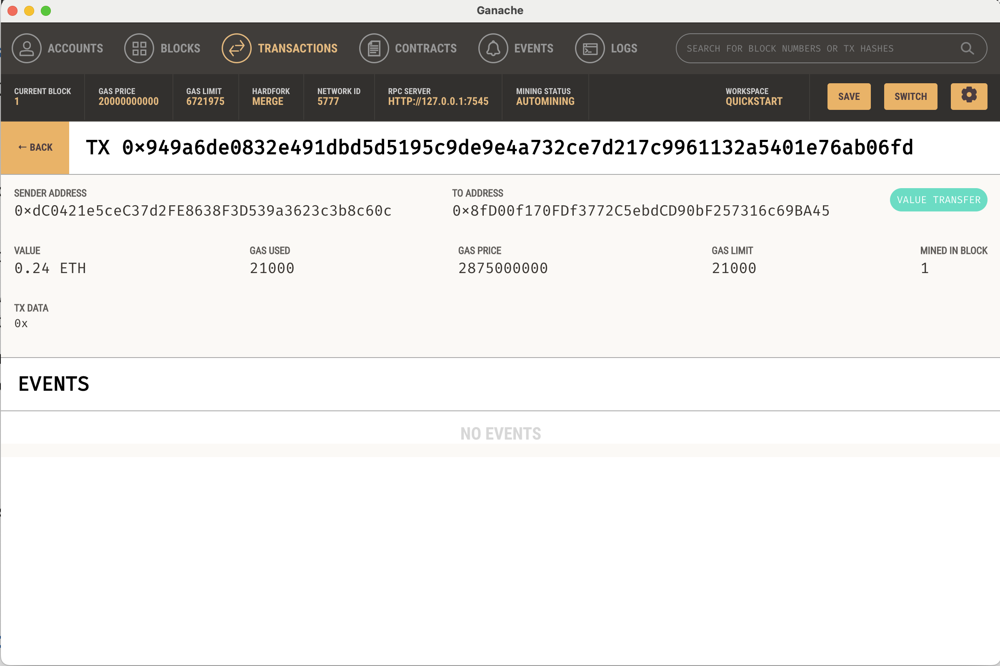

# crypto_wallet_challenge

### Overview
- Using Streamlit, Ganache and Web3 ethereum environment, a block chain environment was created to simulate the block chain generation and transaction between accounts.

### How the program is functioning

##### Step 1. Run 'streamlit run krypto_jobs.py'

This is the main page of the program once it starts to run.

##### Step 2. Select the sender and the number of hours to hire. Then click the send transaction to complete the transaction.

I have selected 'Jo' to hire, and assigned her 1.25 hours. Then clicked the 'send transaction button.

After clicking the send button, you can see that my balanced has been reduced. 

##### Step 3. Go to Ganache and check the transaction

This is Ganache screen after the transaction. You can see that the top account (my account) has reduced balanced from 100 to 99.76 

Went into the 'Blocks' tab to see the created block in detail. You can see the block hash and the transaction hash.

Then I clicked the to address to see it in detail. Value of 0.24 ETH has been transferred from my account to Jo's account.

