# kaseicoin_challenge

## Overview

- A blockchain coin called 'Kasei coin' was created using Remix IDE, MetaMask, and Ganache.
- 'KaseiCoinCrowdsale.sol' file has all the requirements for the challenge, and 'KaseiCoinCrowdsale_with_optional_features.sol' has extra optional functions using OpenZepplin's 'CappedCrowdsale', 'TimedCrowdsale', and RefundablePostDeliveryCrowdsale'.
- In the evaluation evidence and demonstration of functionality, only the 'KaseiCoinCrowdsale.sol' was used.

## Evaluation evidence (compiled contracts)

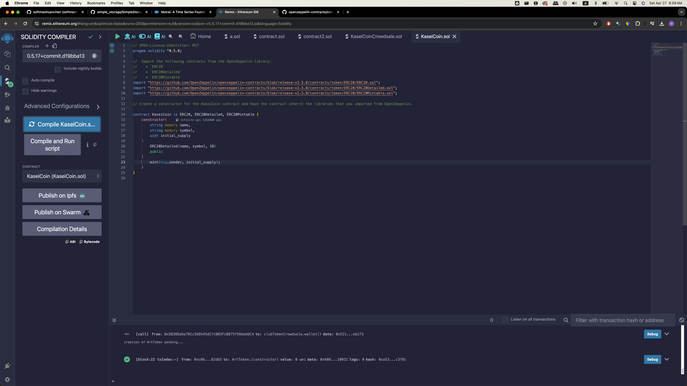
This is the successfully compiled smart contract of 'KaseiCoin'.  
Instead of 0.5.5 version, 0.5.17 version was used to compile  

 

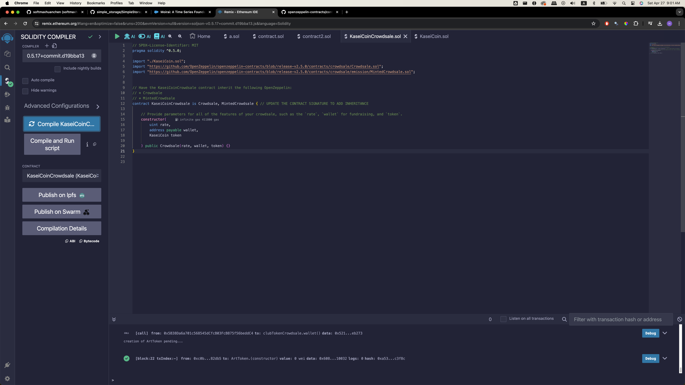
This is the successfully compiled smart contract of 'KaseiCoinCrowdsale'.  
Instead of 0.5.5 version, 0.5.17 version was used to compile  

 

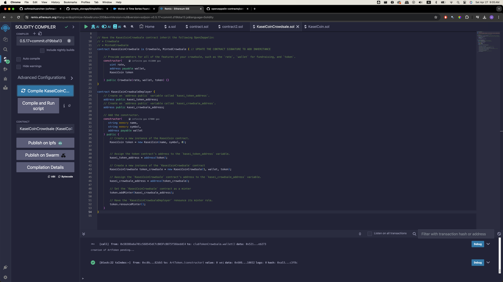
This is the successfully compiled smart contract of 'KaseiCoinCrowdsaleDeployer'  
Instead of 0.5.5 version, 0.5.17 version was used to compile  

 
 

## Demonstration of functionality

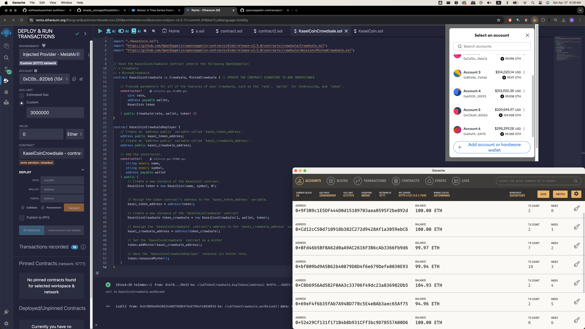
The above image shows that Remix IDE, Metamask, and Ganache are all connected together  
You can see on the Remix IDE account (0xC0b...82Db5), Metamask account 5 (0Xcb69..82Db5), and the fifth account on Ganache (0xCb...Db5) all have the same balance of 104.93 ETH with the matching address, which indicates that all three programs are connected together  
Therefore, now we are ready to deploy the contract  

 
 

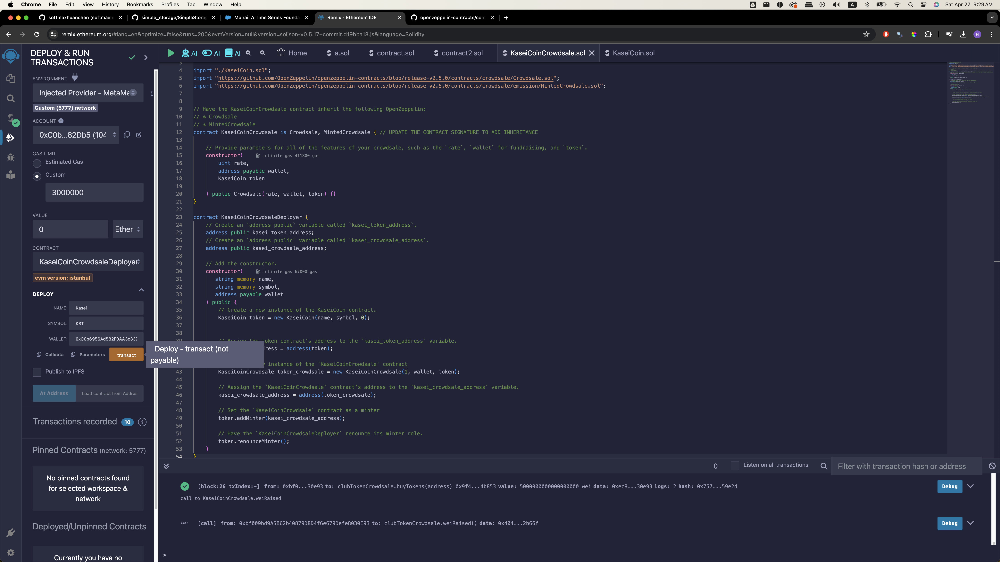
We are deploying the 'KaseiCoinCrowdsaleDeployer' contract here  
I inserted 'Kasei' for the name, 'KST' for symbol, and the (0xC0b..82Db5) as the wallet account  

 
 

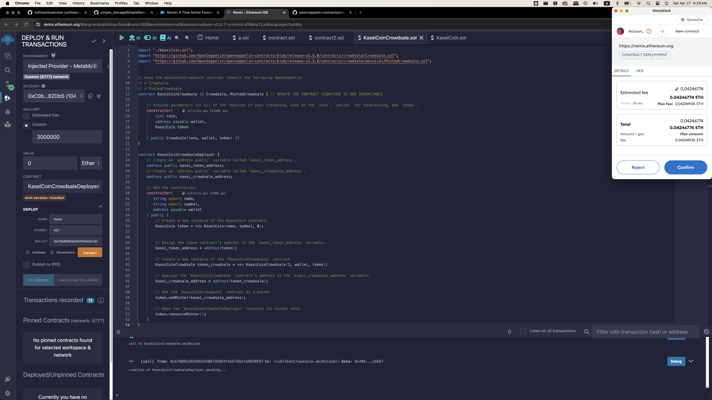
Paying for the deployment of contract  

 
 

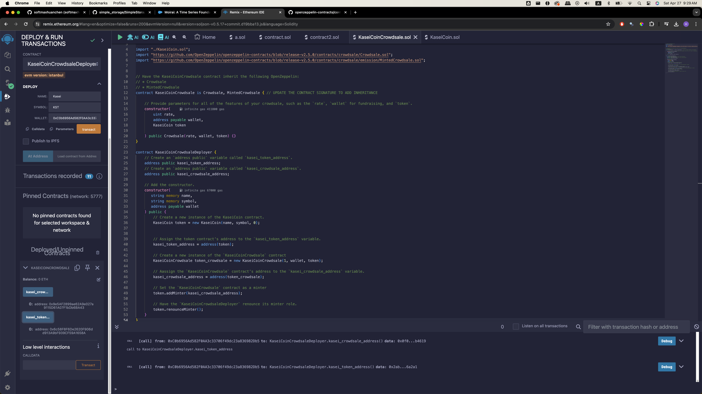
The contract has been successfully deployed. You can now see the 'kasei_crowdsale_address' and 'kasei_token_address'  

 
 

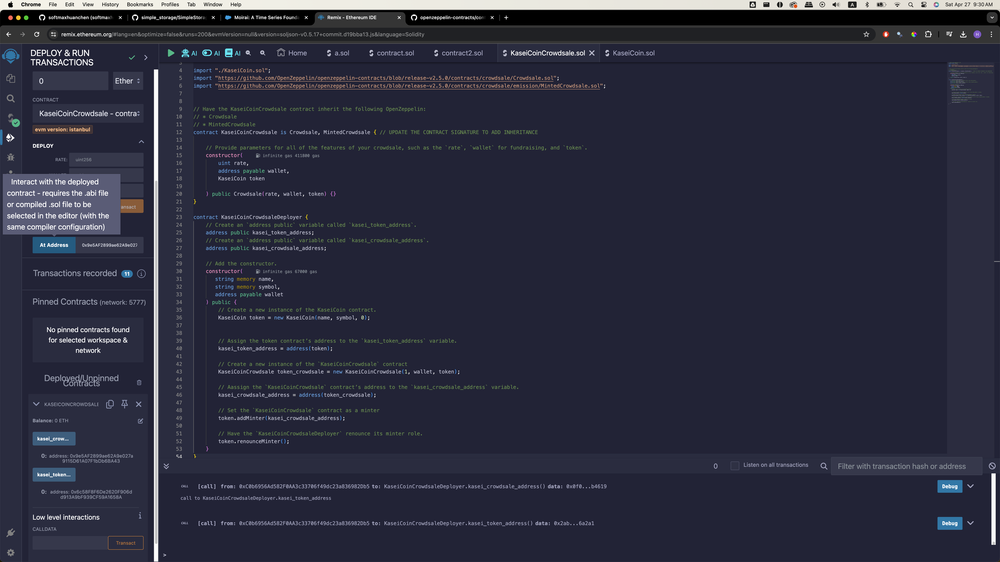
We are now deploying the 'KaseiCoinCrowdsale' contract  
In the 'At address', the 'kasei_crowdsale_address' is entered  

 
 

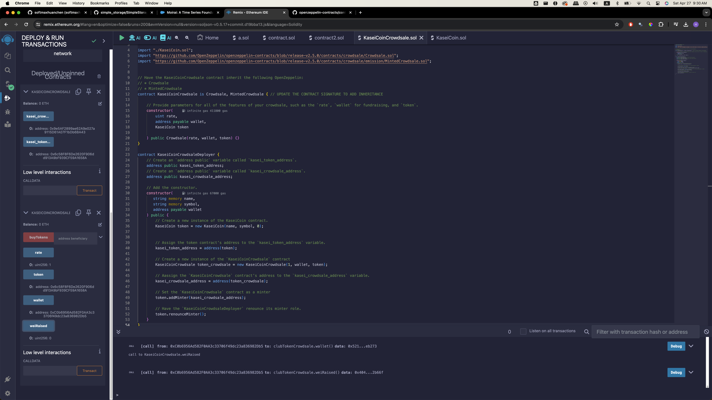
Now the 'KaseiCrowdsale' contract is deployed. You can now see the functions like 'buyTokens', 'rate', 'token', 'wallet', and ' weiRaised'. Because we did not raise any tokens, 'weiRaised' is 0  

 
 

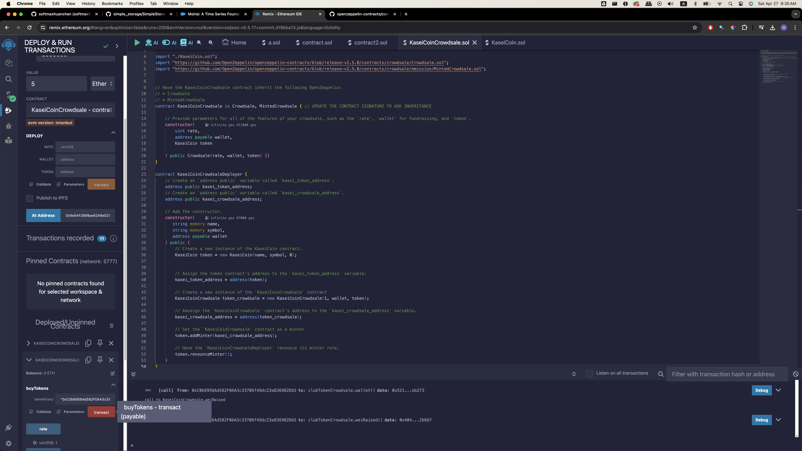
Performing 'buyTokens' function here. You can see above that value of 5 Ethers were entered, and for the beneficiary, address of (0xC0b...82Db5) was selected.  

 
 

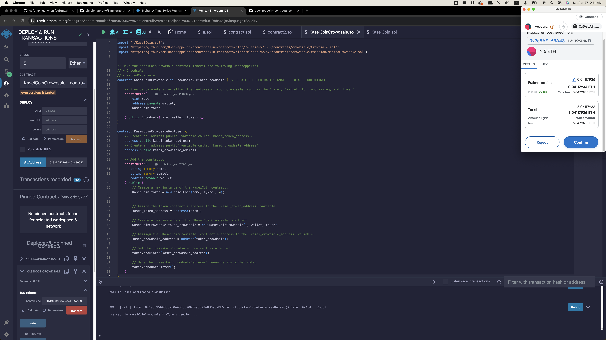
Paying for the transaction  

 
 

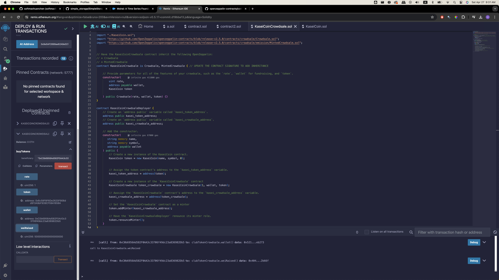
Tokens were successfully bought. 'weiRaised' has been increased.  

 
 

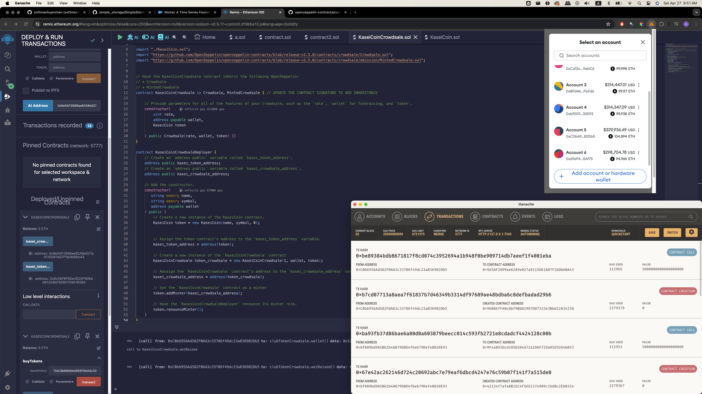
We can see the from the account 5 on Metamask (0xC0b...82Db5), Ether amount has been decreased since that account paied for the transaction.  
Also, the created blocks are shown on Ganache as well  

#### End of demonstration