# remix_contract_challenge

### Overview
- The objective of this challenge is to learn how to create a contract using solidity via REMIX IDE

### Solidity file
- Saved as joint_savings.sol file

### Demonstration of the contract
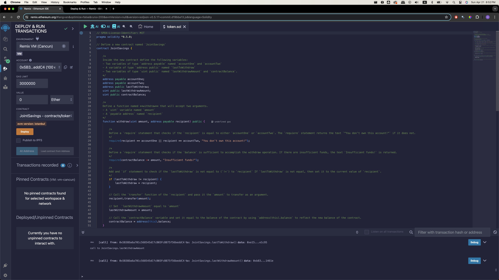
This is the REMIX IDE page when my contract has been complied. I have used '0.5.17' as my complier.
 
 

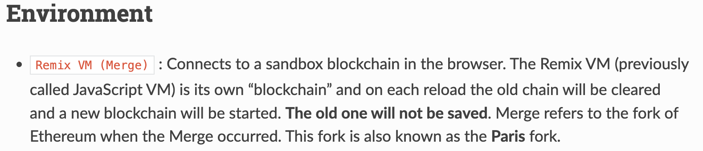
The instruction says I have to use 'Javascrit VM' as my environment, but as you can see in this image, Javascript VM is now called Remix VM. Therefore, I chose the Remiv VM (Cancun) for my demonstration.
 
 

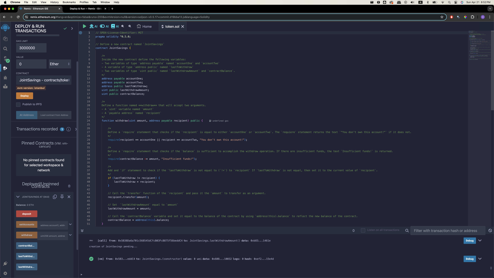
Now the contract has been deployed.
 
 

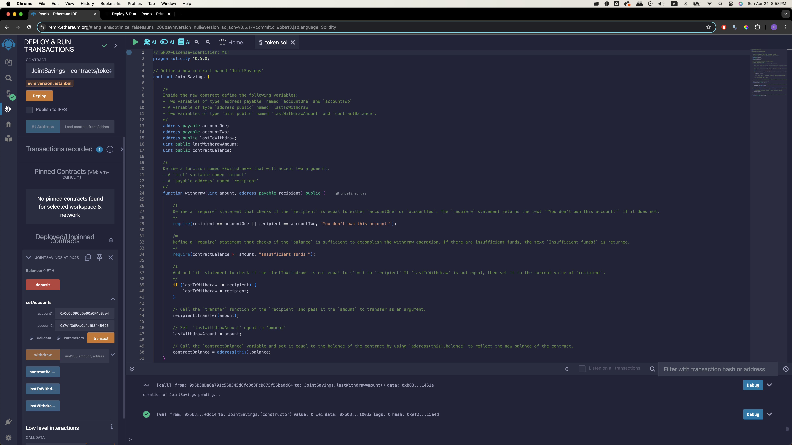
In the setAccount function, the two dummy accounts provided were entered in.
 
 

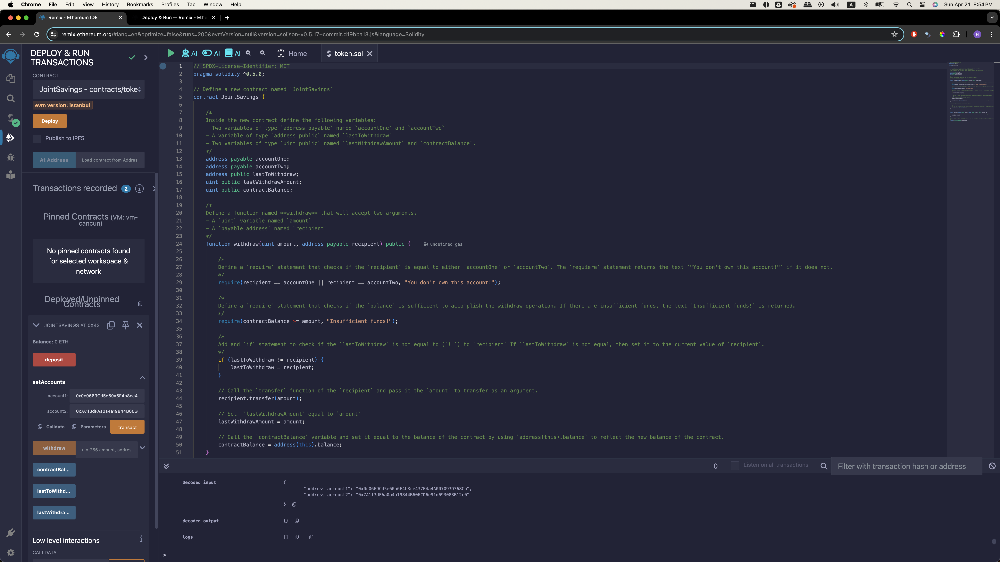
After clicking the 'transact' button, you can see on the terminal that 'address account1' (accountOne) and 'address account2' (accountTwo) has been successfully entered in as the dummy account1 ('0x0c0669Cd5e60a6F4b8ce437E4a4A007093D368Cb') and dummy account2 ('0x7A1f3dFAa0a4a19844B606CD6e91d693083B12c0').
 
 

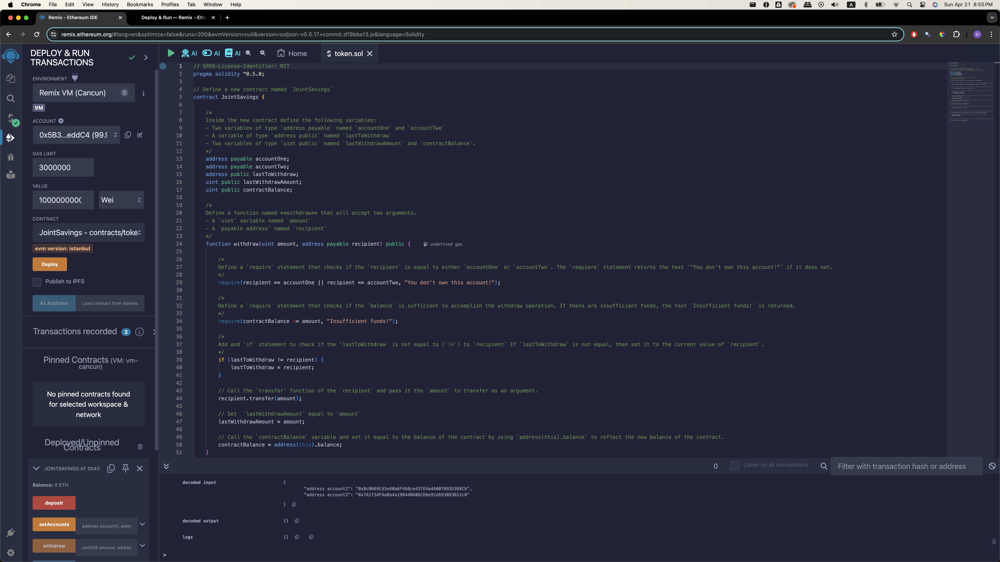
As per instruction, 1 Ether as Wei is entered to deposit. Then, 'deposit' button was clicked.
 
 

'contractBalance' button shows that 1 Ether has been successfully deposited.
 
 

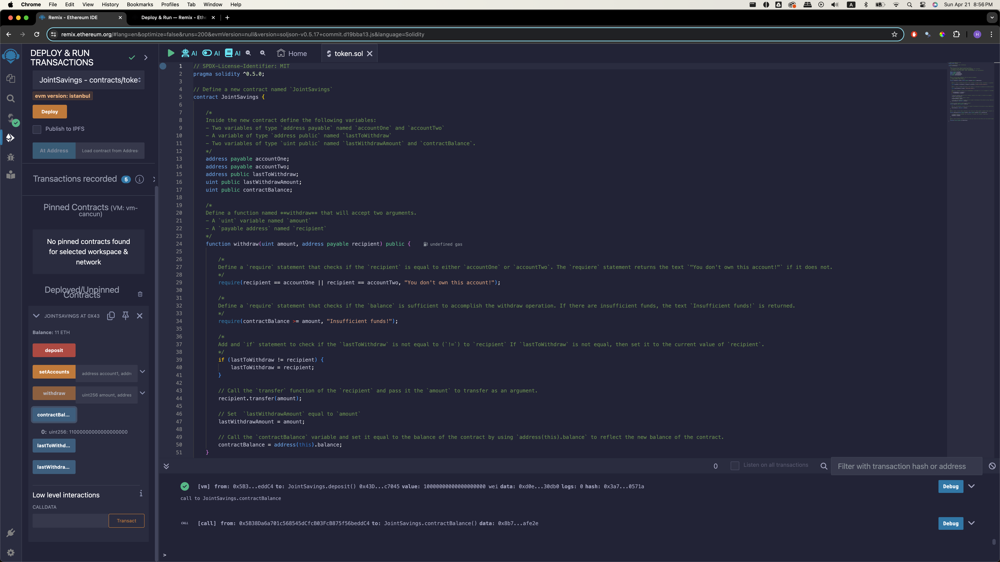
Now, 10 Ethers as Wei is deposited. The 'contractBalance' now shows that 11 Ethers are in the contract balance.
 
 

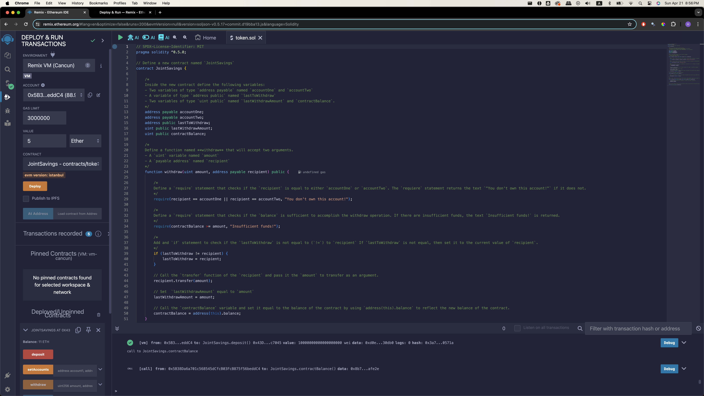
Lastly, 5 Ethers is deposited.
 
 

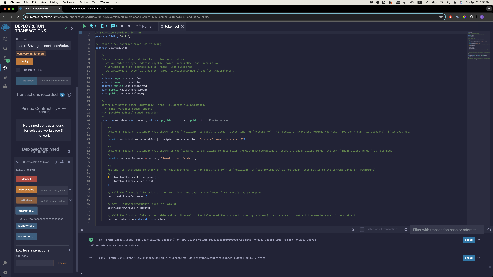
'contractBalance' now shows that 16 Ethers are in the contract Balance.
 
 

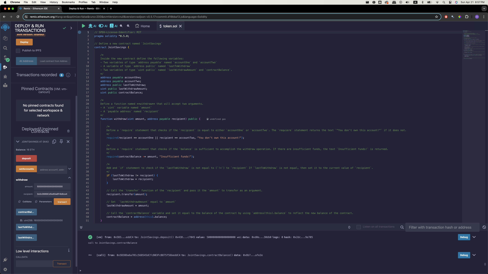
Now, using the 'withdraw' function, 5 Ethers are being withdrawn to the 'accountOne'. Then the button 'transact' is clicked.
 
 

Now the 'contractBalance' is updated to 11 Ethers. 'lastToWithdraw' has the accountOne address, and 'lastWithdrawAmount' shows 5 Ethers. These results are matching with the previous step.
 
 

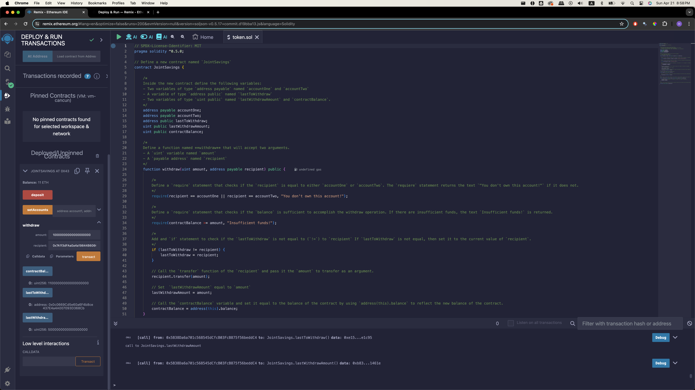
Now, using the 'withdraw' function, 10 Ethers are being withdrawn to the 'accountTwo'. Then the button 'transact' is clicked.
 
 

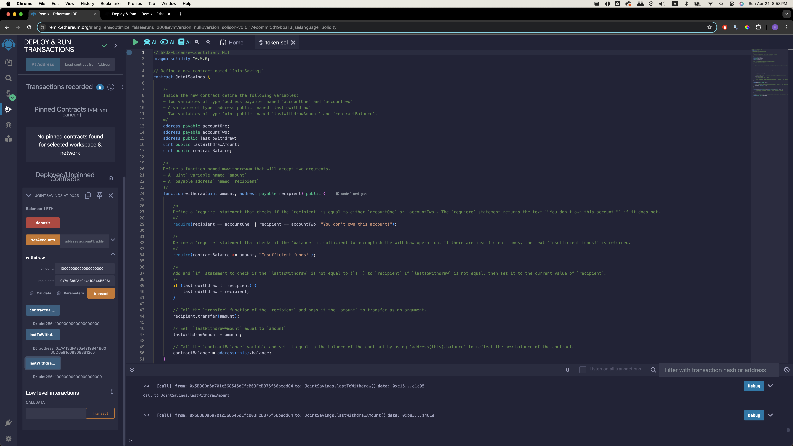
Now the 'contractBalance' is updated to 1 Ether. 'lastToWithdraw' has the accountTwo address now, and 'lastWithdrawAmount' shows 10 Ethers. These results are matching with the previous step.
 

*End of demonstration*

